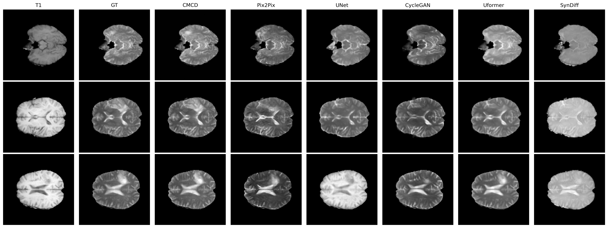

# Cross-Modality Conditional Diffusion (T1 to T2 MRI)

This project implements a cross-modality medical image translation framework based on the Denoising Diffusion Probabilistic Model (DDPM), specifically designed for generating T2-weighted images from corresponding T1-weighted MRI scans.



## 🌟 Core Features & Improvements

This project features deep customizations to the original DDPM architecture to meet the high-precision requirements of medical imaging:

* **Cross-Modality Conditional Guidance (Cross-Attention)**: Introduced cross-attention mechanisms into the Unet architecture. The model extracts features from the T1 conditional image via the `cond_encoder` and uses them as Keys and Values during the denoising process to guide T2 image generation, ensuring accurate anatomical alignment.
* **Classifier-Free Guidance (CFG)**: Integrated CFG logic within `GaussianDiffusion`. By randomly dropping the T1 condition with a certain probability (`cond_drop_prob`) during training, the model can balance realism and adherence to the conditional image during inference by adjusting the `cond_scale`.
* **Multi-Criterion Composite Loss**: To address brightness shifts and detail blurring common in medical image generation, a composite loss function is utilized:
    * **MSE Loss**: The standard noise prediction loss.
    * **L1 Reconstruction Loss**: Derives the original image via `predict_start_from_noise` and calculates the pixel-level error between the predicted and ground-truth T2 images (weight 0.3).
    * **SSIM Loss**: Introduces a Structural Similarity loss to ensure the generated tissue structures visually match the real images (weight 0.2).
* **Single-Channel Optimization**: Optimized the input/output flow specifically for single-channel (grayscale) medical images, defaulting to `channels=1`.

## 🚀 Quick Start
### 1. Install Environment
```bash
pip install -r requirements.txt
```

### 2. Data Preparation
Datasets should be placed in the datasets/ directory following this structure:
* datasets/your_dataset/train/A: Contains T1 training images.
* datasets/your_dataset/train/B: Contains corresponding T2 training images.
* Note: Filenames must correspond; the script automatically matches _t1_ and _t2_ suffixes.

### 3. Train the Model
Run the following command to start training:
```bash
python train.py
```
Training logs will be synced in real-time to the wandb project t1-to-t2-ddpm-whole-image.

You can change the hyper-parameters here to design your own experiment.
```bash
epochs = 30
batch_size = 8
timesteps = 1000
lr = 1e-4
```


### 4. Validation & Generation
Use the validation script to run inference on the test set:
```bash
python test.py
```
Generated results will be saved in the results/generated directory.

You can also change the cfg scale, time steps and the maximum number of image you want to generate.
```bash
timesteps = 1000
cfg_scale = 1.2
max_slices = None
```