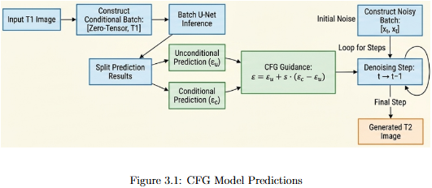
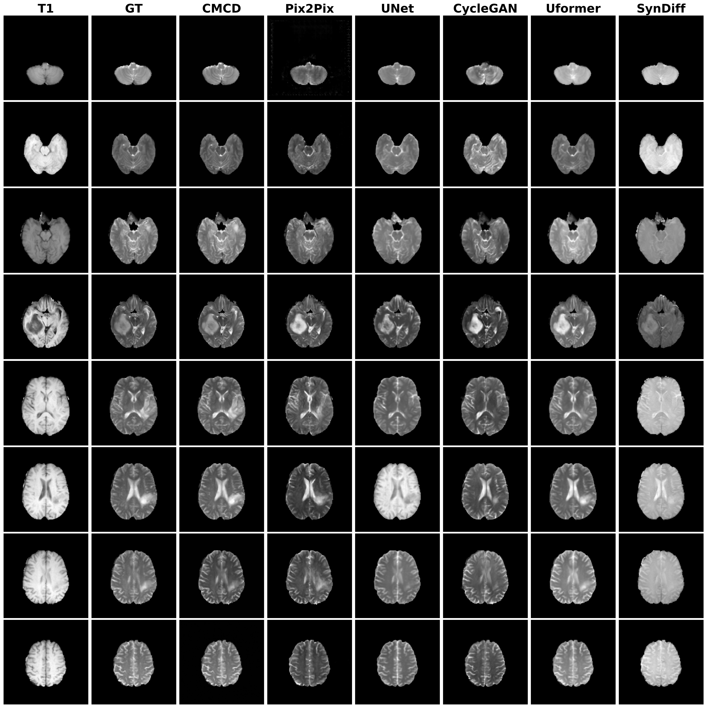

# Cross-Modality Conditional Diffusion (T1 & T2 MRI)

This project implements a cross-modality medical image translation framework based on the Denoising Diffusion Probabilistic Model (DDPM), specifically designed for generating T2-weighted images from corresponding T1-weighted MRI scans.


## 🌟 Core Features & Improvements

This project features deep customizations to the original DDPM architecture to meet the high-precision requirements of medical imaging:

* **Anatomy-Consistent Structural Guidance (ASCG)**: The core technical innovation of the CMCD framework, designed to enforce strict anatomical fidelity during the iterative denoising process. It addresses the limitations of standard diffusion models, which often suffer from structural drift or blurred anatomical boundaries in complex medical regions.
* **Cross-Modality Conditional Guidance (Cross-Attention)**: Introduced cross-attention mechanisms into the Unet architecture. The model extracts features from the T1 conditional image via the `cond_encoder` and uses them as Keys and Values during the denoising process to guide task image generation, ensuring accurate anatomical alignment.
* **Classifier-Free Guidance (CFG)**: Integrated CFG logic within `GaussianDiffusion`. By randomly dropping the condition with a certain probability (`cond_drop_prob`) during training, the model can balance realism and adherence to the conditional image during inference by adjusting the `cond_scale`.
* **Multi-Criterion Composite Loss**: To address brightness shifts and detail blurring common in medical image generation, a composite loss function is utilized:
    * **MSE Loss**: The standard noise prediction loss.
    * **L1 Reconstruction Loss**: Derives the original image via `predict_start_from_noise` and calculates the pixel-level error between the predicted and ground-truth images (weight 0.3).
    * **SSIM Loss**: Introduces a Structural Similarity loss to ensure the generated tissue structures visually match the real images (weight 0.2).
* **Single-Channel Optimization**: Optimized the input/output flow specifically for single-channel (grayscale) medical images, defaulting to `channels=1`.



## 🚀 Quick Start
### 1. Install Environment
We recommend to use a python version >=3.9, but other latest versions may also support.
```bash
pip install -r requirements.txt
```

### 2. Data Preparation
Our model was trained on [BraTS2019](https://www.med.upenn.edu/cbica/brats-2019/) and [BraTS2020](https://www.med.upenn.edu/cbica/brats2020/), you can download from offical website. After that, the dataset should be normalized before transfered from `Nii.` format to `PNG`. Datasets should be placed in the datasets/ directory following this structure:
* datasets/your_dataset/train/A: Contains T1 training images.
* datasets/your_dataset/train/B: Contains corresponding T2 training images.
* Note: Filenames must correspond; the script automatically matches _t1_ and _t2_ suffixes.

### 3. Train the Model
Run the following command to start training:
```bash
python train.py
```
Training logs will be synced in real-time to the wandb project t1-to-t2-cmcd-whole-image.

You can change the hyper-parameters here to design your own experiment.
```bash
epochs = 30
batch_size = 8
timesteps = 1000
lr = 1e-4
```

In this model, we also enable cross attention while training. However, this requires high GPU cost and long training time and limited improvements. So we recommend you keep `use_cross_attn` closed. But if you have high performance GPU, you can try to use cross attention.


### 4. Validation & Generation
Use the validation script to run inference on the test set:
```bash
python test.py
```
Generated results will be saved in the results/generated directory.
You can continue train the model if you have previous checkpoint paths and set `resume_training` True.

You can also change the cfg scale, time steps and the maximum number of image you want to generate.
```bash
timesteps = 1000
cfg_scale = 1.2
max_slices = None
```

